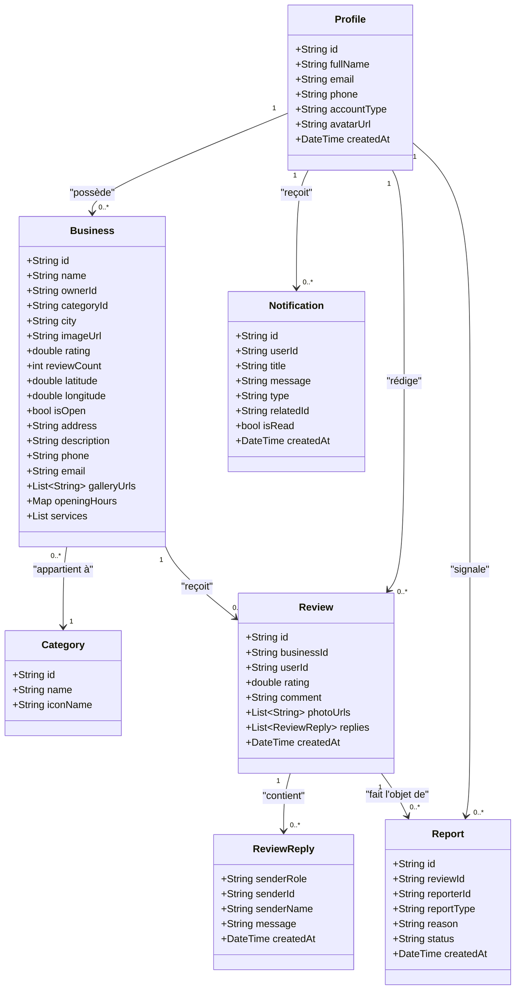
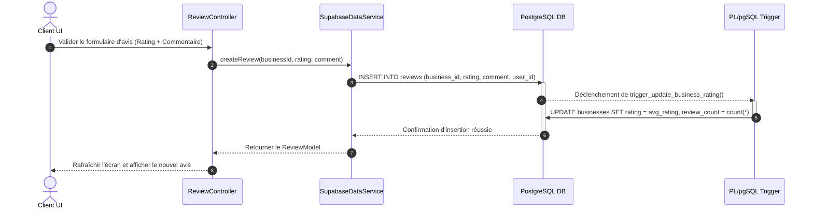
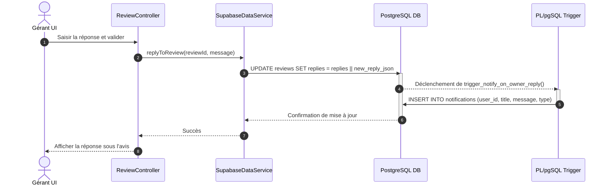
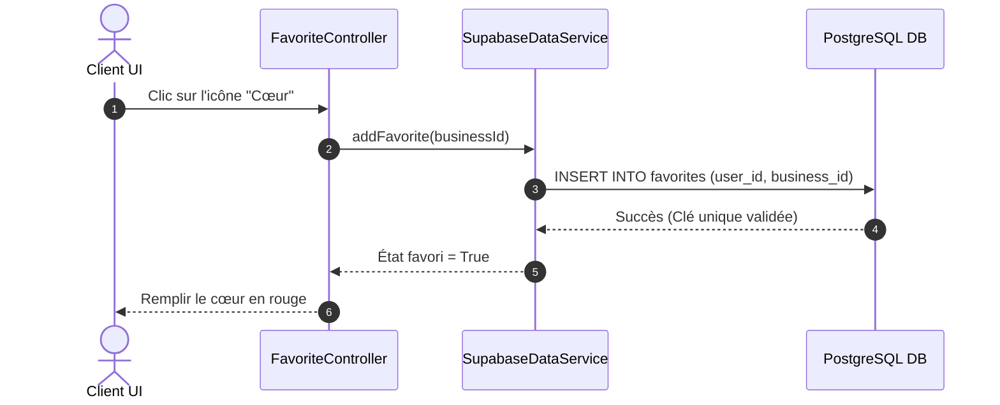
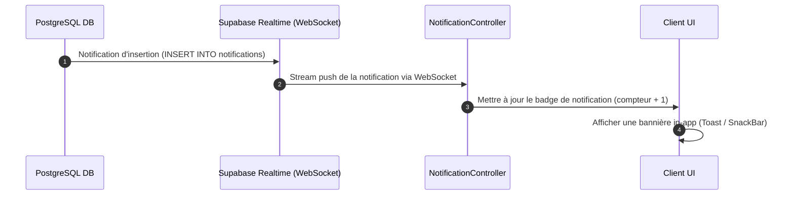
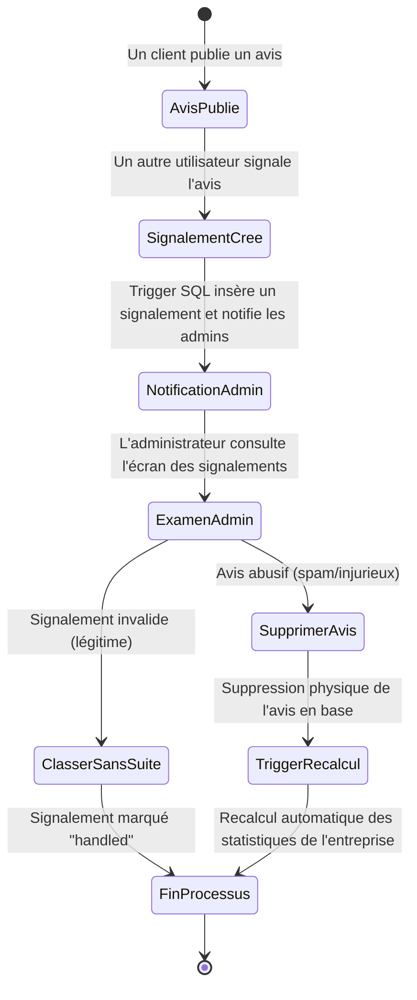
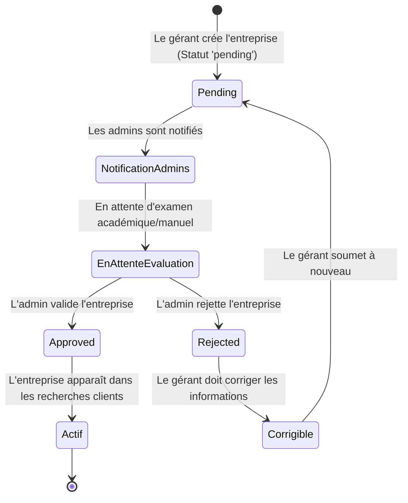
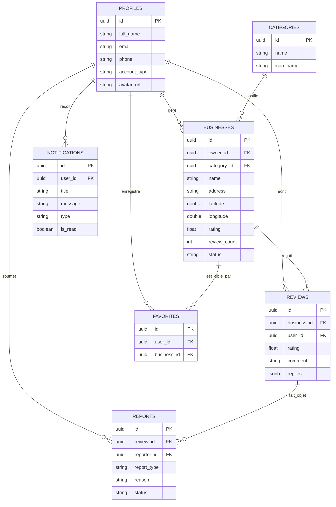

# LIVRE BLANC ET MÉMOIRE TECHNIQUE : DEPLOYEMENT ET CONCEPTION DE REVIEWAPP

## Table des Matières
1. [Présentation Générale du Projet](#1-présentation-générale-du-projet)
   - [Nom du projet](#nom-du-projet)
   - [Description générale](#description-générale)
   - [Contexte du projet](#contexte-du-projet)
   - [Historique et origine de l'idée](#historique-et-origine-de-lidée)
   - [Vision du projet](#vision-du-projet)
   - [Objectifs principaux](#objectifs-principaux)
   - [Objectifs spécifiques](#objectifs-spécifiques)
   - [Public cible](#public-cible)
   - [Parties prenantes](#parties-prenantes)
2. [Contexte et Problématique](#2-contexte-et-problématique)
   - [Contexte actuel du domaine](#contexte-actuel-du-domaine)
   - [Analyse de l'existant](#analyse-de-lexistant)
   - [Limites des solutions actuelles](#limites-des-solutions-actuelles)
   - [Problèmes rencontrés par les utilisateurs](#problèmes-rencontrés-par-les-utilisateurs)
   - [Problématique principale](#problématique-principale)
   - [Questions de recherche](#questions-de-recherche)
   - [Hypothèses de solution](#hypothèses-de-solution)
3. [Analyse des Besoins](#3-analyse-des-besoins)
   - [Besoins fonctionnels](#besoins-fonctionnels)
   - [Besoins non fonctionnels](#besoins-non-fonctionnels)
4. [Étude et Choix des Technologies](#4-étude-et-choix-des-technologies)
   - [Frontend](#frontend)
   - [Backend](#backend)
   - [Base de données](#base-de-données)
   - [Services tiers](#services-tiers)
   - [Tableau comparatif des technologies](#tableau-comparatif-des-technologies-envisagées-et-retenues)
5. [Architecture Générale](#5-architecture-générale)
   - [Description de l'architecture](#description-de-larchitecture)
   - [Diagramme global de l'architecture](#diagramme-global-de-larchitecture)
   - [Flux de données et communication](#flux-de-données-et-communication)
   - [Architecture logicielle (Clean / MVVM / Repository)](#architecture-logicielle-clean--mvvm--repository)
6. [Structure du Projet](#6-structure-du-projet)
   - [Arborescence complète](#arborescence-complète)
   - [Rôle des dossiers et des fichiers principaux](#rôle-des-dossiers-et-des-fichiers-principaux)
7. [Modélisation UML](#7-modélisation-uml)
   - [Diagramme de Cas d'Utilisation](#diagramme-de-cas-dutilisation)
   - [Diagramme de Classes](#diagramme-de-classes)
   - [Diagrammes de Séquence](#diagrammes-de-séquence)
   - [Diagramme d'Activité](#diagramme-dactivité)
   - [Diagramme d'État](#diagramme-détat)
8. [Conception de la Base de Données](#8-conception-de-la-base-de-données)
   - [Dictionnaire de données](#dictionnaire-de-données)
   - [MCD (Modèle Conceptuel de Données)](#mcd-modèle-conceptuel-de-données)
   - [MLD (Modèle Logique de Données)](#mld-modèle-logique-de-données)
   - [MPD (Modèle Physique de Données)](#mpd-modèle-physique-de-données)
9. [Sécurité](#9-sécurité)
   - [Authentification et RLS](#authentification-et-rls)
   - [Protection contre les attaques courantes](#protection-contre-les-attaques-courantes)
10. [Gestion des Notifications](#10-gestion-des-notifications)
    - [Architecture et Déclencheurs](#architecture-et-déclencheurs)
    - [Flux complet de notification](#flux-complet-de-notification)
11. [Gestion de la Géolocalisation](#11-gestion-de-la-géolocalisation)
    - [Intégration d'OpenStreetMap](#intégration-dopenstreetmap)
    - [Marqueurs et Calculs de Proximité](#marqueurs-et-calculs-de-proximité)
12. [Expérience Utilisateur (UX/UI)](#12-expérience-utilisateur-uxui)
    - [Principes de conception & Design System](#principes-de-conception--design-system)
    - [Palette de couleurs et typographie](#palette-de-couleurs-et-typographie)
13. [Scénarios Utilisateurs](#13-scénarios-utilisateurs)
    - [Scénario Client](#scénario-client)
    - [Scénario Business Owner](#scénario-business-owner)
    - [Scénario Administrateur](#scénario-administrateur)
14. [Performances et Optimisations](#14-performances-et-optimisations)
    - [Caching, Pagination et Lazy Loading](#caching-pagination-et-lazy-loading)
15. [Déploiement](#15-déploiement)
    - [Environnements et CI/CD](#environnements-et-cicd)
16. [Maintenance et Évolutions Futures](#16-maintenance-et-évolutions-futures)
    - [Roadmap et perspectives de scalabilité](#roadmap-et-perspectives-de-scalabilité)
17. [Conclusion](#17-conclusion)
    - [Résumé et perspectives](#résumé-et-perspectives)
    - [Annexes, Glossaire et Bibliographie](#annexes-glossaire-et-bibliographie)

---

## 1. Présentation Générale du Projet

### Nom du projet
L'application est nommée **ReviewApp** (ou *Bonita ReviewApp*).

### Description générale
**ReviewApp** est une application multiplateforme d'évaluation et de recommandation de services locaux et de commerces de proximité. Conçue pour rapprocher les clients des professionnels de leur secteur géographique, elle permet aux utilisateurs de rechercher des établissements, de consulter des avis certifiés, de laisser des notations avec photos, d'ajouter des favoris et de naviguer via une carte interactive. Les propriétaires d'entreprises bénéficient d'un tableau de bord statistique et d'un outil de réponse en temps réel, tandis que les administrateurs disposent de consoles dédiées pour valider les nouveaux commerces et modérer les signalements d'avis suspects.

### Contexte du projet
Ce projet s'inscrit dans le cadre du module académique de Licence 3 Informatique (L3) orienté vers le *Développement d'Applications Mobiles et Multiplateformes*. L'objectif pédagogique est de concevoir une application de bout en bout respectant les contraintes logicielles modernes : séparation claire des responsabilités, intégration d'un backend as a service (BaaS) performant et implémentation d'une interface utilisateur dynamique et ergonomique.

### Historique et origine de l'idée
L'idée est née d'un constat simple sur la difficulté d'obtenir des avis authentiques pour les commerces locaux (restaurants, garages, cabinets médicaux, artisans). Alors que les géants du web centralisent de nombreuses données, les commerces indépendants peinent à être mis en valeur de manière équitable et souffrent d'avis malveillants ou non modérés. L'ambition de ReviewApp est de proposer une solution équilibrée où le propriétaire a un droit de réponse direct et transparent, et où les administrateurs veillent activement à l'assainissement de la base de données.

### Vision du projet
Faire de ReviewApp la plateforme de référence locale pour la recherche de services de confiance, en misant sur l'intégrité des avis, la rapidité des échanges entre clients et gérants, et la légèreté de l'application cliente grâce à des traitements SQL asynchrones et automatisés côté serveur.

### Objectifs principaux
1. Fournir une interface mobile et de bureau fluide et performante.
2. Garantir la mise à jour instantanée des données statistiques (moyennes de notes, compteurs de vues).
3. Intégrer un système de géolocalisation robuste pour localiser les commerces à proximité immédiate.

### Objectifs spécifiques
- Authentification unifiée et gestion fine de trois rôles distincts (Client, Business Owner, Administrateur).
- Mise à jour automatique de la note globale d'un commerce par un trigger PostgreSQL lors de la publication d'un avis.
- Prise en charge des signalements d'avis avec workflow de modération.
- Possibilité pour le propriétaire d'uploader un logo et une galerie de photos d'établissement.
- Implémentation d'un système de notifications push et in-app.

### Public cible
- **Les Consommateurs Locaux** : Personnes recherchant des avis de confiance sur les commerces de leur quartier.
- **Les Professionnels / Commerçants** : Entrepreneurs locaux désireux de soigner leur e-réputation et d'interagir avec leur clientèle.
- **Les Modérateurs / Administrateurs** : Garants de la qualité du contenu publié sur la plateforme.

### Parties prenantes
- L'équipe de développement (étudiants concepteurs).
- Le corps professoral de L3 évaluant les compétences en conception et en programmation mobile.
- Les utilisateurs finaux potentiels (commerçants pilotes et panel de testeurs).

---

## 2. Contexte et Problématique

### Contexte actuel du domaine
Le marché mondial des avis en ligne est dominé par des plateformes massives comme Google Business Profile, TripAdvisor et Yelp. L'utilisation de ces services est devenue un réflexe pour la quasi-totalité des internautes avant de réaliser un achat ou de se rendre dans un lieu de service. Cependant, cette hégémonie s'accompagne d'une complexification des algorithmes et d'une déconnexion croissante avec la réalité des petits commerçants.

### Analyse de l'existant
Les solutions existantes reposent sur de vastes bases de données mondiales. Pour un commerçant de quartier, il est complexe de se faire référencer, les coûts publicitaires pour émerger sont élevés, et la communication avec l'assistance en cas d'avis abusif ou de chantage à la mauvaise note est souvent infructueuse.

### Limites des solutions actuelles
- **Délai de modération** : Les signalements prennent parfois des semaines à être analysés.
- **Opacité des calculs** : Les notes moyennes sont influencées par des algorithmes complexes dont les règles de pondération demeurent secrètes.
- **Coût d'entrée** : Les fonctionnalités statistiques ou de mise en avant requièrent des abonnements coûteux.

### Problèmes rencontrés par les utilisateurs
- **Clients** : Perte de confiance face à des avis douteux (achats de faux avis).
- **Professionnels** : Impuissance face à la diffamation en ligne et absence de canal de réponse standardisé et gratuit.

### Problématique principale
*Comment concevoir une plateforme d'avis de services de proximité qui garantit la confiance mutuelle entre les consommateurs et les professionnels locaux, tout en assurant une modération réactive et une mise à jour instantanée et intègre des données de performance ?*

### Questions de recherche
1. Comment alléger le traitement des calculs de notation sur l'application cliente tout en garantissant des données toujours à jour ?
2. Quelle structure d'authentification et de sécurité appliquer pour empêcher la manipulation des avis par des robots ou des utilisateurs malveillants ?
3. Comment assurer une expérience de recherche fluide avec géolocalisation sur des supports hétérogènes (mobiles d'entrée de gamme, tablettes, ordinateurs) ?

### Hypothèses de solution
- **Hypothèse 1** : L'utilisation d'une base de données relationnelle dotée de déclencheurs stockés (*PostgreSQL Triggers*) permet de recalculer les notes moyennes instantanément en tâche de fond de façon ultra-performante et intègre.
- **Hypothèse 2** : L'implémentation de la sécurité au niveau des lignes (*Row Level Security - RLS*) au sein de la base de données assure qu'un utilisateur ne puisse écrire d'avis qu'en son propre nom et que le gérant ne réponde qu'aux avis le concernant.
- **Hypothèse 3** : Le framework Flutter combiné à la gestion d'état Riverpod permet de bâtir une application cross-platform partageant 100% de la logique métier tout en maintenant un rendu natif fluide à 60 FPS.

---

## 3. Analyse des Besoins

### Besoins fonctionnels

L'application doit remplir les fonctionnalités suivantes selon les profils d'utilisateurs :

```
                                  +-----------------------+
                                  |     Utilisateurs      |
                                  +-----------------------+
                                              |
                     +------------------------+------------------------+
                     |                        |                        |
         +-----------v-----------++-----------v-----------++-----------v-----------+
         |        Client         ||     Business Owner    ||     Administrateur    |
         +-----------------------++-----------------------++-----------------------+
         | - Inscription/Login   || - Inscription/Login   || - Login               |
         | - Profil public       || - Dashboard Pro       || - Console d'admin     |
         | - Rechercher un pro   || - Demande de création || - Valider/Rejeter pro |
         | - Géolocalisation     ||   d'entreprise        || - Gérer catégories    |
         | - Ajouter aux favoris || - Éditer profil pro   || - Modérer avis        |
         | - Laisser un avis     || - Répondre aux avis   || - Consulter stats     |
         | - Signaler un avis    || - Consulter stats     || - Notifications       |
         | - Notifications       || - Notifications       ||                       |
         +-----------------------++-----------------------++-----------------------+
```

1. **Authentification & Profils**
   - Inscription classique avec contrôle du format de l'e-mail, mot de passe robuste, et numéro de téléphone à 10 chiffres.
   - Connexion via Google (OAuth) pour une expérience simplifiée.
   - Édition de profil avec téléchargement d'avatar personnel.
   - Choix du type de compte à l'inscription (Client ou Professionnel).
2. **Gestion des Entreprises (Businesses)**
   - Formulaire de création d'entreprise avec champs obligatoires (nom, description, adresse, téléphone, email, catégorie).
   - Renseignement des horaires d'ouverture et des services proposés avec leurs tarifs.
   - Téléchargement du logo officiel et d'une galerie d'images pour illustrer l'établissement.
   - Édition des données de l'entreprise par son propriétaire exclusif.
3. **Gestion des Avis & Réponses**
   - Évaluation par étoiles (de 1 à 5) et commentaire rédigé.
   - Téléchargement de photos d'illustration dans l'avis.
   - Édition et suppression de son propre avis par le client.
   - Ajout d'une réponse ou d'un fil de discussion par le gérant de l'établissement sous l'avis.
4. **Gestion des Favoris**
   - Possibilité d'épingler des établissements en favoris pour y accéder rapidement depuis un écran dédié.
5. **Géolocalisation & Recherche**
   - Recherche textuelle par mots-clés, filtrage par catégorie ou par ville.
   - Visualisation des commerces sur une carte interactive (OpenStreetMap).
   - Visualisation de la distance estimée entre l'utilisateur et l'établissement.
6. **Notifications**
   - Système de notification in-app pour avertir :
     - Les propriétaires lorsqu'un nouvel avis est posté.
     - Les clients quand un gérant répond à leur avis.
     - Les propriétaires lorsque leur établissement est validé ou rejeté par l'admin.
     - Les administrateurs en cas de nouvelle entreprise en attente ou de signalement d'avis.
7. **Administration & Modération**
   - Liste des entreprises en attente avec option d'approbation ou de rejet.
   - Liste des avis signalés avec affichage de la raison du signalement, et possibilité de supprimer l'avis concerné ou de classer le signalement sans suite.
   - CRUD des catégories de services (nom, icône associée).

### Besoins non fonctionnels

1. **Performance**
   - Fluidité d'affichage : transitions fluides et animations de micro-interactions (utilisation de `flutter_animate`).
   - Temps de réponse : requêtes base de données inférieures à 200ms grâce à l'optimisation des requêtes et à l'indexation.
2. **Sécurité**
   - RLS (Row Level Security) activé sur toutes les tables de la base de données.
   - Chiffrement des mots de passe géré par Supabase (chiffrement bcrypt).
   - Sécurisation du stockage d'images (les fichiers ne peuvent être téléversés que dans les dossiers correspondants aux IDs des utilisateurs connectés).
3. **Disponibilité & Scalabilité**
   - Architecture cloud serverless (Supabase / AWS en arrière-plan) garantissant un taux de disponibilité supérieur à 99.9%.
4. **Maintenabilité**
   - Utilisation d'un code hautement typé en Dart, respectant les règles d'analyse de `flutter_lints`.
   - Séparation stricte de l'état (Riverpod) et des widgets de présentation.
5. **Responsive Design & Accessibilité**
   - Adaptation automatique de l'interface aux tailles d'écrans de 360dp de large (petits téléphones) à plus de 1200dp (écrans d'ordinateurs en mode Web/Desktop) via `responsive_framework`.
   - Gestion d'un mode sombre (Dark Mode) dynamique basé sur les préférences de l'utilisateur ou du système.

---

## 4. Étude et Choix des Technologies

### Frontend

#### Flutter (Framework principal)
- **Avantages** : Compilateur AOT (Ahead-of-Time) générant du code natif ARM et x86. Rendu graphique direct via le moteur Skia/Impeller, évitant les ponts JavaScript lents propres à React Native. Multiplateforme réel (un seul codebase pour Android, iOS, Web, Windows).
- **Pourquoi ce choix** : Idéal pour un projet L3 devant être déployé rapidement sur mobile et sur poste de travail Windows pour démonstration, sans multiplier les équipes de développement.

### Backend

#### Supabase (Backend-as-a-Service)
- **Avantages** : Solution Open-Source de BaaS bâtie sur PostgreSQL. Fournit une couche d'authentification complète, un stockage de fichiers (bucket compatible S3) et un moteur temps réel via WebSockets sans aucune configuration complexe.
- **Pourquoi ce choix** : Contrairement à Firebase qui utilise une base NoSQL orientée documents (Firestore), Supabase met à disposition une véritable base relationnelle SQL. Les relations complexes entre utilisateurs, entreprises, avis et signalements sont ainsi modélisées naturellement et avec intégrité.

### Base de données

#### PostgreSQL
- **Comparaison** :
  - *Firestore* : Flexible mais complique les jointures de données et les calculs d'agrégation (comme la note moyenne). Nécessite beaucoup de requêtes ou de la dénormalisation coûteuse.
  - *MySQL* : Relationnel et solide, mais n'intègre pas nativement les outils Cloud modernes d'authentification et de Realtime par défaut dans les BaaS gratuits.
  - *PostgreSQL (Supabase)* : Supporte les requêtes complexes, dispose d'un type JSONB ultra-performant (utilisé pour stocker les fils de discussions dans les avis), et permet l'écriture de fonctions PL/pgSQL sécurisées s'exécutant directement sur le serveur.
- **Justification** : PostgreSQL s'impose comme le choix le plus robuste pour garantir la cohérence des calculs statistiques de notations et la gestion fine des permissions RLS.

### Services tiers

- **Cartographie : OpenStreetMap & flutter_map** : Choix d'une solution libre et gratuite. Évite la configuration de clés API payantes Google Maps, tout en offrant d'excellentes performances d'affichage de cartes sous forme de tuiles.
- **Google Sign-In** : Permet la connexion instantanée en un clic sur Android et Web, réduisant le taux d'abandon au tunnel de connexion.
- **Supabase Storage** : Pour héberger et distribuer rapidement les fichiers médias (avatars, logos d'entreprises, photos d'avis) via un CDN mondial intégré.

### Tableau comparatif des technologies envisagées et retenues

| Segment | Technologie Envisagée | Technologie Retenue | Justification |
| :--- | :--- | :--- | :--- |
| **Frontend** | React Native | **Flutter (Dart)** | Meilleure performance d'affichage (Impeller) et typage Dart plus rigoureux pour un projet académique. |
| **Backend** | Firebase | **Supabase** | Base de données SQL relationnelle nécessaire pour structurer proprement les liaisons de clés étrangères. |
| **Base de Données**| Firestore (NoSQL) | **PostgreSQL** | Permet de faire des triggers serveurs PL/pgSQL pour recalculer automatiquement les moyennes des notes. |
| **Cartographie** | Google Maps SDK | **OpenStreetMap** | Gratuité totale de l'API de tuiles, intégration native simplifiée dans Flutter via `flutter_map`. |
| **Gestion d'État** | Provider / BLoC | **Riverpod** | Sécurité à la compilation, absence de dépendance envers le BuildContext, idéal pour les flux asynchrones. |

---

## 5. Architecture Générale

### Description de l'architecture
L'application adopte une architecture modulaire basée sur le **Repository Pattern** combiné au patron **MVVM (Model-View-ViewModel)** matérialisé par Riverpod.

```
                    +--------------------------------------------+
                    |                 UI Layer                   |
                    | (Views, Screens, Widgets, responsive layout)|
                    +---------------------^----------------------+
                                          | Ecoute et Notifie
                    +---------------------v----------------------+
                    |             Controller Layer               |
                    | (Riverpod Providers & StateNotifiers)     |
                    +---------------------^----------------------+
                                          | Appelle les méthodes
                    +---------------------v----------------------+
                    |            Repository Layer                |
                    | (AuthRepository, SupabaseDataService)      |
                    +---------------------^----------------------+
                                          | Requêtes SQL & API
                    +---------------------v----------------------+
                    |          Data Layer (Supabase BaaS)        |
                    |   - PostgreSQL (Tables, Triggers, Views)   |
                    |   - Storage Buckets (Avatars, Businesses)  |
                    |   - Supabase Auth (JWT Tokens)             |
                    +--------------------------------------------+
```

### Diagramme global
Le flux d'informations s'établit comme suit :
1. L'utilisateur clique sur un bouton de la vue (**View**).
2. La vue invoque une méthode asynchrone du contrôleur (**Controller**).
3. Le contrôleur bascule son état à *chargement en cours* (isLoading = true), déclenchant le rafraîchissement visuel d'un indicateur de progression à l'écran.
4. Le contrôleur appelle le dépôt de données (**Repository**).
5. Le dépôt interagit avec l'API Supabase (**Data Service**).
6. Supabase exécute la requête, applique les politiques RLS en base de données et retourne le résultat.
7. Le dépôt convertit les données brutes (JSON) en entités Dart (**Models**).
8. Le contrôleur met à jour son état avec les entités reçues.
9. La vue écoute le changement d'état du contrôleur et redessine l'écran avec les nouvelles données.

### Communication entre couches
La communication est strictement unidirectionnelle vers le bas pour les requêtes, et réactive vers le haut pour les notifications d'état. Les couches supérieures ne connaissent pas les détails d'implémentation des couches inférieures : par exemple, la vue n'a pas conscience que les données proviennent de Supabase, elle ne connaît que le contrôleur et l'entité de modèle.

### Architecture logicielle

- **La Couche Présentation (Views & Widgets)** : Contient uniquement les déclarations de widgets Flutter. Ces classes sont sans état propre (StatelessWidget ou ConsumerWidget) et délèguent toute la logique métier à Riverpod.
- **La Couche Logique Métier (Controllers / ViewModels)** : Gère l'état de l'interface utilisateur. Utilise des `StateNotifier` ou des `ChangeNotifier` pour exposer des états immuables ou notifier des changements.
- **La Couche Dépôt (Repositories & Services)** : Fait l'interface avec la source de données externe. Elle encapsule le client Supabase et effectue la conversion des types SQL vers les modèles Dart.
- **Injection de Dépendances** : Entièrement réalisée par Riverpod. Les dépôts et services sont instanciés dans des variables globales immobiles de type `Provider`, ce qui garantit qu'une seule instance est créée et partagée tout au long du cycle de vie de l'application.

---

## 6. Structure du Projet

L'arborescence du projet s'articule comme suit :

```
lib/
├── constants/          # Constantes de l'application (configurations globales)
├── controllers/        # Contrôleurs d'état (Riverpod) faisant le pont entre UI et Repositories
│   ├── auth_controller.dart
│   ├── auth_providers.dart
│   ├── favorite_controller.dart
│   ├── favorite_providers.dart
│   ├── home_controller.dart
│   ├── notification_controller.dart
│   └── review_controller.dart
├── models/             # Modèles de données (conversion JSON/Dart)
│   ├── business_model.dart
│   ├── category_model.dart
│   ├── notification_model.dart
│   └── review_model.dart
├── repositories/       # Couche d'accès aux données (abstraction des APIs)
│   └── auth_repository.dart
├── routes/             # Configuration des routes de navigation (GoRouter)
│   └── app_router.dart
├── services/           # Services techniques (connexion Supabase, simulation de cartes)
│   ├── location_sim_service.dart
│   ├── maps_sim_service.dart
│   └── supabase_data_service.dart
├── theme/              # Fichiers de thèmes (pour les polices et couleurs globales)
├── utils/              # Validations, convertisseurs et palettes colorimétriques de l'UI
│   ├── couleur.dart    # Définition des couleurs de l'application
│   └── validators.dart # Classes de validation des formulaires
├── views/              # Dossiers contenant les différents écrans de l'application
│   ├── admin/          # Console d'administration (Dashboard, Validation, Signalements)
│   ├── auth/           # Écrans de connexion, inscription, onboarding, reset mot de passe
│   ├── business/       # Écrans réservés aux propriétaires (Création, Dashboard, Édition, Stats)
│   └── client/         # Écrans pour les clients (Détail pro, recherche, carte, favoris, avis)
├── widgets/            # Éléments d'interface réutilisables (appbar, drawer, navbars)
└── main.dart           # Point d'entrée de l'application (initialisation et démarrage)
```

### Rôle des dossiers et des fichiers principaux

- **[main.dart](file:///d:/bonita/ReviewApp/lib/main.dart)** : Initialise les liaisons Flutter, charge les variables d'environnement depuis le fichier `.env`, initialise la connexion globale au client Supabase et configure la langue locale en français pour les dates (`intl`). Il lance l'application enveloppée dans un `ProviderScope` Riverpod.
- **[app_router.dart](file:///d:/bonita/ReviewApp/lib/routes/app_router.dart)** : Gère le routage via GoRouter. Il implémente des guards de sécurité (`redirect`) vérifiant le rôle de l'utilisateur (Client, Business ou Admin) pour l'orienter vers l'interface adéquate et empêcher les accès non autorisés.
- **[supabase_data_service.dart](file:///d:/bonita/ReviewApp/lib/services/supabase_data_service.dart)** : Fichier pivot effectuant toutes les requêtes en base de données. Il implémente la récupération des entreprises, la publication d'avis, le chargement des images binaires dans le stockage de Supabase, et les requêtes spécifiques à l'administrateur (gestion des catégories et récupération des signalements).
- **[validators.dart](file:///d:/bonita/ReviewApp/lib/utils/validators.dart)** : Contient l'ensemble des règles de validation regex pour l'email, la longueur des mots de passe et le format strict des numéros de téléphone (10 chiffres).

---

## 7. Modélisation UML

### Diagramme de Cas d'Utilisation

Ce diagramme présente les interactions entre les trois acteurs principaux (Client, Gérant de commerce, Administrateur) et le système.

```mermaid
usecaseDiagram
    actor Client
    actor BusinessOwner as "Business Owner (Pro)"
    actor Admin as "Administrateur"

    Client --> (S'authentifier)
    Client --> (Rechercher un commerce)
    Client --> (Consulter les détails d'un commerce)
    Client --> (Ajouter aux favoris)
    Client --> (Laisser un avis avec notation)
    Client --> (Signaler un avis abusif)
    Client --> (Consulter ses notifications)

    BusinessOwner --> (S'authentifier)
    BusinessOwner --> (Demander la création d'une entreprise)
    BusinessOwner --> (Mettre à jour ses informations professionnelles)
    BusinessOwner --> (Répondre aux avis clients)
    BusinessOwner --> (Consulter ses statistiques de visites)
    BusinessOwner --> (Consulter ses notifications)

    Admin --> (S'authentifier)
    Admin --> (Valider ou rejeter un commerce en attente)
    Admin --> (Consulter et traiter les signalements d'avis)
    Admin --> (Gérer les catégories de services)
    Admin --> (Visualiser les statistiques globales du système)
```

### Diagramme de Classes

Ce diagramme modélise la structure des entités manipulées par l'application Flutter.



### Diagrammes de Séquence

#### 1. Création d'un avis client et mise à jour automatique des statistiques
Ce diagramme détaille comment la publication d'un avis par un client déclenche le trigger PostgreSQL en base de données pour mettre à jour la moyenne de l'entreprise.



#### 2. Réponse à un avis par le Business Owner
Ce diagramme montre le processus de réponse d'un commerçant, stocké sous forme de fil JSONB et déclenchant une notification pour le client d'origine.



#### 3. Ajout d'une entreprise en favori


#### 4. Flux de notification temps réel


### Diagramme d'Activité

Ce diagramme représente le processus métier de signalement d'un avis client et sa modération subséquente par un administrateur.



### Diagramme d'État

Cycle de vie d'une demande de création d'entreprise soumise par un Business Owner.



---

## 8. Conception de la Base de Données

La base de données relationnelle est propulsée par PostgreSQL sous Supabase. Les schémas ci-dessous décrivent la structure logique et physique du système.

### Dictionnaire de données

#### 1. Table `profiles`
Stocke les informations personnelles et les rôles de tous les utilisateurs.

| Nom de colonne | Type SQL | Contraintes | Description |
| :--- | :--- | :--- | :--- |
| `id` | UUID | PRIMARY KEY, REFERENCES auth.users(id) | Identifiant unique issu de l'Auth Supabase. |
| `full_name` | TEXT | NOT NULL | Nom et prénom de l'utilisateur. |
| `email` | TEXT | UNIQUE, NOT NULL | Adresse de messagerie. |
| `phone` | VARCHAR(15) | | Numéro de téléphone. |
| `account_type` | VARCHAR(20) | CHECK (in ('client', 'business_owner', 'admin')) | Rôle utilisateur déterminant ses accès. |
| `avatar_url` | TEXT | | Lien public vers la photo de profil. |
| `created_at` | TIMESTAMPTZ| DEFAULT now() | Date et heure de création. |

#### 2. Table `businesses`
Contient les informations descriptives et statistiques des entreprises référencées.

| Nom de colonne | Type SQL | Contraintes | Description |
| :--- | :--- | :--- | :--- |
| `id` | UUID | PRIMARY KEY, DEFAULT gen_random_uuid() | Identifiant unique du commerce. |
| `owner_id` | UUID | REFERENCES public.profiles(id) | ID du propriétaire gérant le commerce. |
| `category_id` | UUID | REFERENCES public.categories(id) | Catégorie d'activité principale. |
| `name` | TEXT | NOT NULL | Nom officiel de l'établissement. |
| `description` | TEXT | | Présentation détaillée de l'activité. |
| `address` | TEXT | NOT NULL | Adresse physique. |
| `city` | TEXT | DEFAULT 'Antananarivo' | Ville d'implantation. |
| `image_url` | TEXT | | Logo de l'entreprise. |
| `gallery_urls` | JSONB | DEFAULT '[]'::jsonb | Liste ordonnée de photos d'illustration. |
| `rating` | NUMERIC(3,2) | DEFAULT 0.00 | Moyenne des avis (mise à jour par Trigger). |
| `review_count` | INTEGER | DEFAULT 0 | Nombre total d'avis validés (par Trigger). |
| `latitude` | DOUBLE PRECISION| NOT NULL | Latitude géographique pour cartographie. |
| `longitude`| DOUBLE PRECISION| NOT NULL | Longitude géographique pour cartographie. |
| `is_open` | BOOLEAN | DEFAULT TRUE | Indicateur d'activité en cours. |
| `is_popular` | BOOLEAN | DEFAULT FALSE | Indicateur pour mise en valeur visuelle. |
| `phone` | TEXT | | Numéro de téléphone professionnel. |
| `email` | TEXT | | Adresse e-mail de contact pro. |
| `opening_hours`| JSONB | DEFAULT '{}'::jsonb | Dictionnaire des horaires d'ouverture. |
| `services` | JSONB | DEFAULT '[]'::jsonb | Liste de services proposés (nom + tarif). |
| `status` | VARCHAR(20) | CHECK (in ('pending', 'approved', 'rejected')) | Statut de validation administrative. |
| `created_at` | TIMESTAMPTZ| DEFAULT now() | Date d'enregistrement. |

#### 3. Table `reviews`
Avis rédigés par les clients sur les fiches des entreprises.

| Nom de colonne | Type SQL | Contraintes | Description |
| :--- | :--- | :--- | :--- |
| `id` | UUID | PRIMARY KEY, DEFAULT gen_random_uuid() | Identifiant unique de l'avis. |
| `business_id` | UUID | REFERENCES public.businesses(id) ON DELETE CASCADE | ID du commerce évalué. |
| `user_id` | UUID | REFERENCES public.profiles(id) ON DELETE CASCADE | ID du client auteur de l'avis. |
| `rating` | NUMERIC(2,1) | CHECK (rating >= 1.0 AND rating <= 5.0) | Note attribuée (de 1 à 5). |
| `comment` | TEXT | | Message rédigé par l'évaluateur. |
| `photo_urls` | JSONB | DEFAULT '[]'::jsonb | Liste d'images téléversées avec l'avis. |
| `replies` | JSONB | DEFAULT '[]'::jsonb | Fil de réponses (propriétaire et/ou client). |
| `created_at` | TIMESTAMPTZ| DEFAULT now() | Date de publication. |

### MCD (Modèle Conceptuel de Données)

Le schéma ci-dessous modélise les relations sémantiques entre les entités principales de l'application.



### MLD (Modèle Logique de Données)

Les relations logiques s'écrivent sous la forme relationnelle standard suivante :

- **PROFILES** (<u>id</u>, full_name, email, phone, account_type, avatar_url, created_at)
- **CATEGORIES** (<u>id</u>, name, icon_name, created_at)
- **BUSINESSES** (<u>id</u>, #owner_id, #category_id, name, description, address, city, image_url, gallery_urls, rating, review_count, latitude, longitude, is_open, is_popular, phone, email, opening_hours, services, status, created_at)
- **REVIEWS** (<u>id</u>, #business_id, #user_id, rating, comment, photo_urls, replies, created_at)
- **FAVORITES** (<u>id</u>, #user_id, #business_id, created_at)
- **REPORTS** (<u>id</u>, #review_id, #reporter_id, report_type, reason, status, created_at, updated_at)
- **NOTIFICATIONS** (<u>id</u>, #user_id, title, message, type, related_id, is_read, created_at)
- **BUSINESS_VIEWS** (<u>id</u>, #business_id, #user_id, created_at)

### MPD (Modèle Physique de Données)

Voici les instructions de création SQL réelles des principales tables extraites des scripts d'automatisation de la base de données :

```sql
-- Table des profils (liée à auth.users de Supabase via Trigger interne d'inscription)
CREATE TABLE IF NOT EXISTS public.profiles (
    id UUID PRIMARY KEY REFERENCES auth.users(id) ON DELETE CASCADE,
    full_name TEXT NOT NULL,
    email TEXT UNIQUE NOT NULL,
    phone VARCHAR(15),
    account_type VARCHAR(20) NOT NULL DEFAULT 'client' CHECK (account_type IN ('client', 'business_owner', 'admin')),
    avatar_url TEXT,
    created_at TIMESTAMPTZ DEFAULT now()
);

-- Table des catégories
CREATE TABLE IF NOT EXISTS public.categories (
    id UUID PRIMARY KEY DEFAULT gen_random_uuid(),
    name TEXT NOT NULL UNIQUE,
    icon_name TEXT NOT NULL,
    created_at TIMESTAMPTZ DEFAULT now()
);

-- Table des entreprises
CREATE TABLE IF NOT EXISTS public.businesses (
    id UUID PRIMARY KEY DEFAULT gen_random_uuid(),
    owner_id UUID REFERENCES public.profiles(id) ON DELETE SET NULL,
    category_id UUID REFERENCES public.categories(id) ON DELETE SET NULL,
    name TEXT NOT NULL,
    description TEXT,
    address TEXT NOT NULL,
    city TEXT NOT NULL DEFAULT 'Antananarivo',
    image_url TEXT,
    gallery_urls JSONB DEFAULT '[]'::jsonb,
    rating NUMERIC(3,2) DEFAULT 0.00,
    review_count INTEGER DEFAULT 0,
    latitude DOUBLE PRECISION NOT NULL,
    longitude DOUBLE PRECISION NOT NULL,
    is_open BOOLEAN DEFAULT true,
    is_popular BOOLEAN DEFAULT false,
    phone TEXT,
    email TEXT,
    opening_hours JSONB DEFAULT '{}'::jsonb,
    services JSONB DEFAULT '[]'::jsonb,
    status VARCHAR(20) DEFAULT 'pending' CHECK (status IN ('pending', 'approved', 'rejected')),
    created_at TIMESTAMPTZ DEFAULT now()
);

-- Table des avis
CREATE TABLE IF NOT EXISTS public.reviews (
    id UUID PRIMARY KEY DEFAULT gen_random_uuid(),
    business_id UUID REFERENCES public.businesses(id) ON DELETE CASCADE,
    user_id UUID REFERENCES public.profiles(id) ON DELETE CASCADE,
    rating NUMERIC(2,1) NOT NULL CHECK (rating >= 1.0 AND rating <= 5.0),
    comment TEXT,
    photo_urls JSONB DEFAULT '[]'::jsonb,
    replies JSONB DEFAULT '[]'::jsonb,
    created_at TIMESTAMPTZ DEFAULT now()
);

-- Table des favoris
CREATE TABLE IF NOT EXISTS public.favorites (
    id UUID PRIMARY KEY DEFAULT gen_random_uuid(),
    user_id UUID REFERENCES public.profiles(id) ON DELETE CASCADE,
    business_id UUID REFERENCES public.businesses(id) ON DELETE CASCADE,
    created_at TIMESTAMPTZ DEFAULT now(),
    UNIQUE(user_id, business_id)
);
```

---

## 9. Sécurité

La sécurité de ReviewApp repose sur deux remparts complémentaires : la validation stricte des données côté client et le contrôle d'accès granulaire côté serveur.

### Authentification et RLS
L'authentification s'appuie sur le protocole JWT (JSON Web Tokens) généré par Supabase Auth. Une fois connecté, chaque requête de l'application contient le jeton d'authentification.
La sécurité des données est renforcée par l'activation du **Row Level Security (RLS)** sur toutes les tables de la base de données PostgreSQL :

- **Profils (`profiles`)** : Un utilisateur connecté ne peut modifier que sa propre ligne (`auth.uid() = id`).
- **Avis (`reviews`)** :
  - La lecture est ouverte à tous (anonymes et connectés).
  - L'insertion requiert d'être authentifié et de correspondre à l'ID auteur (`auth.uid() = user_id`).
  - La modification et suppression physique sont réservées à l'auteur de l'avis ou aux administrateurs.
- **Favoris (`favorites`)** : Les lignes ne sont visibles et modifiables que par l'utilisateur propriétaire (`auth.uid() = user_id`).
- **Signalements (`reports`)** : Les clients connectés peuvent uniquement insérer un signalement. Seuls les administrateurs ont le droit de les lister (`SELECT`) et de les modifier (`UPDATE` de statut).

### Protection contre les attaques courantes
1. **Injections SQL** : Le client Flutter communique avec Supabase via une API PostgREST hautement sécurisée. Les requêtes SQL ne sont pas assemblées sous forme de chaînes de caractères brutes, éliminant tout risque d'injection SQL sur le client.
2. **Attaques XSS** : Dart compile le code source vers du langage machine natif pour mobile (ou en JavaScript sécurisé et échappé pour le Web). Il n'y a pas d'interprétation dynamique de code HTML non sécurisé au sein des widgets textuels de l'application.
3. **Vols de Session (CSRF)** : Le stockage local du JWT s'effectue dans le stockage sécurisé du système (SharedPreferences chiffré ou Keychain iOS), le protégeant des accès tiers.
4. **Validation des Entrées** : La classe `AppValidators` effectue des vérifications regex en temps réel (frappe par frappe) sur l'ensemble des formulaires. Le bouton d'envoi demeure désactivé tant que tous les critères de sécurité ne sont pas remplis.

---

## 10. Gestion des Notifications

ReviewApp implémente un système de notification d'événements automatique, déporté au niveau de la base de données pour assurer la réactivité et la fiabilité.

### Architecture et Déclencheurs

L'insertion de notifications n'est pas codée en dur dans l'application Flutter. À la place, des **Triggers PostgreSQL** écoutent les modifications sur les tables cibles :

```
             INSERT/UPDATE sur la table
  Avis / Entreprise / Signalement (PostgreSQL)
                   |
                   v
          Déclenchement du Trigger
                   |
                   v
    Création automatique d'une ligne dans
      la table 'notifications' (UUID destinataire)
                   |
                   v
   Diffusion via Supabase Realtime (WebSocket)
                   |
                   v
   Réception instantanée sur l'application Flutter
```

### Flux complet de notification

1. **Publication d'un avis** : L'insertion d'une ligne dans `reviews` déclenche `trigger_notify_on_new_review()`. Cette fonction PL/pgSQL identifie l'ID du gérant du commerce et ajoute automatiquement une notification avec le titre "Nouvel avis" et le message contenant la note attribuée.
2. **Réponse d'un propriétaire** : Le trigger `trigger_notify_on_owner_reply()` détecte l'ajout d'une réponse dans la colonne `replies` d'un avis, identifie le client évaluateur et lui envoie une notification "Réponse du propriétaire".
3. **Signalement d'un avis** : L'insertion d'un signalement dans `reports` déclenche `notify_admins_new_report()`, qui parcourt la table `profiles` pour trouver les comptes de type 'admin' et crée une notification sur leur tableau de bord.
4. **Changement d'état d'un commerce** : Lors de la modification du statut d'une entreprise par l'administrateur (de *pending* à *approved* ou *rejected*), le trigger notifie directement le propriétaire de l'établissement.

---

## 11. Gestion de la Géolocalisation

La géolocalisation est une composante essentielle de ReviewApp pour diriger l'utilisateur vers des commerces proches de sa position.

### Intégration d'OpenStreetMap
La cartographie utilise le package `flutter_map`, qui permet de restituer des tuiles de cartes issues d'**OpenStreetMap** sans surcoût financier ni limitation de requêtes.
La vue `search_screen.dart` intègre une carte interactive où l'utilisateur peut zoomer, se déplacer et voir sa position géographique représentée par un point bleu pulsant.

### Marqueurs et Calculs de Proximité
- **Marqueurs de commerces** : Les coordonnées (latitude, longitude) stockées dans la table `businesses` sont utilisées pour placer des pins (marqueurs) interactifs sur la carte. Un clic sur un marqueur ouvre une fiche synthétique de l'entreprise proposant de naviguer vers son profil complet.
- **Simulation de position** : Le service `location_sim_service.dart` simule le positionnement GPS de l'utilisateur (centré par défaut sur Antananarivo, Madagascar: latitude -18.8792, longitude 47.5079) afin de garantir une démonstration fluide, y compris sur des émulateurs de bureau ou de navigateurs dépourvus de puces GPS réelles.
- **Calcul de la distance** : L'application utilise la formule mathématique de **Haversine** (distance sur une sphère) pour calculer la distance physique en kilomètres entre la position actuelle de l'utilisateur et le commerce :

$$d = 2R \arcsin\left(\sqrt{\sin^2\left(\frac{\Delta \phi}{2}\right) + \cos(\phi_1)\cos(\phi_2)\sin^2\left(\frac{\Delta \lambda}{2}\right)}\right)$$

où $R = 6371\text{ km}$, $\phi$ est la latitude et $\lambda$ est la longitude. Ce calcul permet de classer les résultats de recherche par ordre de proximité.

---

## 12. Expérience Utilisateur (UX/UI)

L'interface de ReviewApp a été peaufinée pour offrir un aspect haut de gamme, moderne et accessible.

### Principes de conception & Design System
L'application respecte les lignes directrices de **Material 3** tout en s'affranchissant des thèmes par défaut rigides au profit d'un design personnalisé :
- **Bords arrondis** constants sur les cartes (16dp) et les champs de saisie (14dp).
- **Transitions animées** : Utilisation de `flutter_animate` pour animer l'apparition des éléments (effet de fondu et de glissement vers le haut lors de l'ouverture des pages).
- **Micro-interactions** : Les boutons réagissent visuellement au toucher ou au survol de la souris (changements d'opacité et de couleur).

### Palette de couleurs et typographie

#### Palette Colorimétrique
L'application supporte nativement un thème clair et un thème sombre.

```
 Thème Clair :
   - Fond global        : #F8FAFC (Slate Light)
   - Surface Cartes     : #FFFFFF
   - Texte Principal    : #0F172A (Slate Dark)
   - Texte Secondaire   : #475569
   - Bordures           : #E2E8F0

 Thème Sombre :
   - Fond global        : #0F172A (Slate Dark)
   - Surface Cartes     : #1E293B (Slate Card)
   - Texte Principal    : #F8FAFC
   - Texte Secondaire   : #94A3B8

 Couleurs Communes :
   - Couleur Primaire   : #2563EB (Primary Royal Blue)
   - Couleur Secondaire : #06B6D4 (Cyan Teal)
   - Erreur / Alerte    : #EF4444 (Red Alert)
   - Succès             : #10B981 (Emerald Green)
```

#### Typographie
La police de caractères retenue est **Poppins**, importée dynamiquement via `google_fonts`. Elle confère un aspect géométrique, moderne et très lisible à l'ensemble des titres et paragraphes de l'application.

---

## 13. Scénarios Utilisateurs

### Scénario Client
1. **Connexion** : Marc ouvre l'application, choisit de se connecter via Google ou saisit ses identifiants. Les champs d'email et mot de passe valident sa saisie en direct.
2. **Recherche** : Il arrive sur l'accueil, sélectionne la catégorie "Restaurant", puis clique sur la vue Carte. Il aperçoit les restaurants à moins de 2 km.
3. **Avis** : Il clique sur le restaurant "Le Gourmand", consulte la fiche complète, puis appuie sur "Laisser un avis". Il attribue 4 étoiles, rédige un commentaire élogieux, associe une photo de son plat prise avec son appareil photo, et soumet.
4. **Favoris** : Intéressé par cette adresse, il clique sur le cœur pour l'ajouter à ses favoris afin de la retrouver plus tard.

### Scénario Business Owner
1. **Création d'entreprise** : Rindra, propriétaire d'un salon de coiffure, s'inscrit en choisissant le compte "Professionnel". Il remplit le formulaire de création d'entreprise en renseignant son adresse, ses horaires et télécharge son logo. Son commerce passe en statut 'pending'.
2. **Validation & Notification** : Dès que l'administrateur valide sa fiche, Rindra reçoit une notification in-app. Son commerce devient visible du public.
3. **Gestion des avis** : Marc ayant laissé un avis sur son salon, Rindra reçoit une notification. Il ouvre sa console Pro, accède à l'avis de Marc et rédige une réponse de remerciement.

### Scénario Administrateur
1. **Validation d'établissements** : Hery se connecte avec son compte Administrateur. Son menu de navigation est enrichi d'onglets spécifiques. Il accède à "Approbations" et valide la demande de Rindra après vérification des coordonnées.
2. **Modération** : Il consulte l'onglet "Signalements" et constate qu'un avis a été signalé pour "spam". Il analyse le contenu de l'avis incriminé et décide de le supprimer définitivement du système en un clic.
3. **Statistiques** : Sur son tableau de bord d'administration, il consulte le nombre total d'utilisateurs inscrits, d'entreprises actives et de signalements en cours.

---

## 14. Performances et Optimisations

Pour assurer une navigation fluide même sur des terminaux aux ressources matérielles limitées, plusieurs optimisations ont été mises en œuvre :

### Caching, Pagination et Lazy Loading
- **Gestion d'État Réactive (Riverpod)** : Les données récupérées de Supabase sont mises en cache dans la mémoire vive de l'application via des `StateProvider` ou `StreamProvider`. Si l'utilisateur change d'onglet et revient sur l'accueil, les données s'affichent instantanément sans réinterroger le serveur.
- **Pagination des Avis** : La récupération des avis d'une entreprise est limitée à 10 par lot (`limit(10)`). Un mécanisme de défilement infini charge les avis suivants uniquement si l'utilisateur fait défiler l'écran vers le bas.
- **Lazy Loading des Images** : Les photos de la galerie d'une entreprise ne sont décodées en mémoire et affichées que lorsqu'elles entrent dans la zone visible de l'écran (viewport) grâce à l'utilisation de `CachedNetworkImage`.
- **Indexation de la Base de Données** : Des index B-Tree ont été ajoutés sur les colonnes clés fréquemment utilisées dans les clauses de filtrage (`WHERE`) et de jointures :
  - Index sur `business_id` dans la table `reviews`.
  - Index sur `owner_id` dans la table `businesses`.
  - Index de recherche composite sur `user_id` et `business_id` dans `favorites`.

---

## 15. Déploiement

### Environnements et CI/CD

#### Environnement de Développement (Local)
L'application pointe vers une instance de développement Supabase. Les clés API publiques et l'URL du projet sont stockées dans un fichier `.env` à la racine du projet (exclu du suivi Git pour des raisons évidentes de sécurité).

#### Environnement de Production
Lors de la mise en production, les variables d'environnement de production sont injectées au moment de la compilation de l'application.

#### Pipeline CI/CD (GitHub Actions)
Un workflow GitHub Actions automatisé est configuré pour s'exécuter à chaque commit ou Pull Request validée sur la branche principale `main` :
1. **Analyse de code** : Commande `flutter analyze` pour vérifier qu'aucun warning ou erreur de typage n'est présent.
2. **Tests automatisés** : Lancement de la suite de tests unitaires via `flutter test`.
3. **Build Android** : Génération de l'APK de production signé et de l'Android App Bundle (AAB) prêt pour le Google Play Store.
4. **Déploiement Web** : Compilation de la version web de l'application (`flutter build web`) et déploiement automatique sur Firebase Hosting ou GitHub Pages.

---

## 16. Maintenance et Évolutions Futures

### Roadmap et perspectives de scalabilité

Le projet ReviewApp est conçu pour évoluer vers une plateforme commerciale d'envergure.

#### 1. Court Terme (V2)
- **Authentification forte** : Intégration de la validation d'e-mails par envoi d'un code OTP.
- **Messagerie Instantanée** : Ajout d'un canal de chat direct et privé entre un client et un gérant pour les demandes de devis.

#### 2. Moyen Terme (V3)
- **Système de Réservation de Créneaux** : Permettre aux clients de réserver directement un service depuis l'application (ex: réserver une table, prendre rendez-vous chez le coiffeur).
- **Algorithme d'Anti-Fraude IA** : Intégration d'un service d'analyse de texte intelligent (NLP) pour bloquer automatiquement les avis contenant des propos inappropriés ou suspectés d'être des faux avis (générés par IA).

#### 3. Long Terme (V4)
- **Monétisation Premium** : Option payante pour les commerçants souhaitant voir leur établissement apparaître en tête des résultats de recherche locaux ou ajouter des galeries de photos illimitées.

---

## 17. Conclusion

### Résumé et perspectives
**ReviewApp** démontre la viabilité d'un modèle d'application d'avis locaux alliant la flexibilité d'un frontend compilé sous Flutter et la rigueur d'un backend relationnel sous Supabase. Grâce à l'exploitation intelligente des fonctionnalités avancées de PostgreSQL (RLS, déclencheurs stockés, indexation), l'application décharge le terminal client des calculs lourds, améliorant ainsi considérablement l'autonomie de la batterie et la réactivité globale de l'interface.

### Valeur ajoutée du projet
L'application résout la problématique de la confiance dans les avis en fournissant un outil transparent et modéré rapidement. Pour les étudiants concepteurs, ce projet a permis d'acquérir une expertise solide sur le cycle de vie de développement logiciel mobile, l'écriture de règles de sécurité SQL strictes et la gestion globale d'une base de données cloud.

---

## Annexes, Glossaire et Bibliographie

### Glossaire

- **BaaS (Backend as a Service)** : Modèle de service cloud où les développeurs externalisent les tâches d'infrastructure (base de données, authentification, stockage) à des tiers (ex: Supabase, Firebase).
- **RLS (Row Level Security)** : Fonctionnalité de base de données permettant de restreindre les lignes renvoyées par une requête en fonction de l'identité de l'utilisateur connecté.
- **Trigger (Déclencheur)** : Fonction SQL automatique s'exécutant en réponse à un événement d'insertion, de modification ou de suppression sur une table spécifique.
- **JWT (JSON Web Token)** : Jeton sécurisé servant à prouver l'identité d'un utilisateur connecté auprès d'un serveur.
- **Haversine** : Formule de trigonométrie sphérique calculant la distance entre deux points à la surface d'une sphère à partir de leurs coordonnées GPS.

### API et Services Tiers Utilisés
- **Supabase JS API** (v2.6.0) : Communication client-serveur et gestion d'authentification.
- **OpenStreetMap Nominatim** : Moteur de rendu cartographique public et libre de droits.
- **Google Fonts API** : Intégration de la police Poppins.

### Bibliographie et Références
1. *Flutter Documentation (Official)* - https://docs.flutter.dev
2. *Supabase & PostgreSQL Security Guidelines* - https://supabase.com/docs/guides/auth/row-level-security
3. *PostgreSQL PL/pgSQL Procedural Language Documentation* - https://www.postgresql.org/docs/current/plpgsql.html
4. *Responsive Web Design in Flutter Framework* - Responsive Framework Guidelines.
